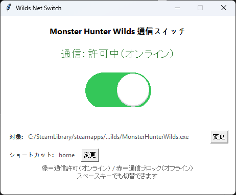

# MHWS Offline Switch

モンスターハンターワイルズ（と推測されるゲーム）のオンライン接続とオフラインモードを簡易的に切り替えるためのWindows用ツールです。

Windows Defender ファイアウォールの設定を自動的に変更することで、ゲームのインターネット通信をワンクリックまたはホットキーで遮断・許可します。



## 主な機能

- シンプルなUIによる通信ON/OFF切り替え
- 現在の通信状態（許可/ブロック）を色とテキストで表示
- グローバルホットキーによるアプリケーション外からの操作
- 対象となるゲーム実行ファイルのパスをGUIから簡単に変更可能
- 設定は `WildsNetSwitch.config.json` ファイルに自動保存
- 起動時に管理者権限を要求

## 必須環境

- Windows OS
- PowerShell
- Python 3.x

## インストール

1.  このリポジトリをダウンロードまたはクローンします。
2.  必要なライブラリをインストールします。
    ```sh
    pip install keyboard
    ```

## 設定

スクリプトを実行すると、同じディレクトリに `WildsNetSwitch.config.json` が自動的に生成されます。

- **`game_exe`**: 通信を制御したいゲームの実行ファイル（例: `MonsterHunterWilds.exe`）のフルパスです。GUIの「変更」ボタンからいつでも変更できます。
- **`hotkey`**: 通信状態を切り替えるためのグローバルホットキーです。GUIの「変更」ボタンから設定できます。（例: `home`, `ctrl+alt+f12`）

```json
{
  "game_exe": "C:/SteamLibrary/steamapps/common/MonsterHunterWilds/MonsterHunterWilds.exe",
  "hotkey": "home"
}
```

## 使い方

1.  以下のコマンドでスクリプトを実行します。
    ```sh
    python wilds_net_switch.py
    ```
2.  初回起動時など、管理者権限で実行するためにUAC（ユーザーアカウント制御）のプロンプトが表示される場合があります。「はい」を選択してください。
3.  GUIが表示されたら、以下のいずれかの方法で通信状態を切り替えられます。
    - 画面中央のスイッチをクリック
    - `スペース`キーを押す
    - 設定したホットキーを押す
4.  状態表示
    - **緑**: 通信許可（オンライン）
    - **赤**: 通信ブロック（オフライン）

## 仕組み

このツールは、Windows Defender ファイアウォールに `BlockWilds_WildsOutbound` という名前の送信ルールを追加/削除することで機能します。

- **ブロック（オフライン）**: 指定された実行ファイルのすべての**送信**接続をブロックするファイアウォールルールを作成し、有効化します。
- **許可（オンライン）**: 上記で作成したファイアウォールルールを**削除**し、OSのデフォルトの通信状態に戻します。

## ライセンス

このプロジェクトはMITライセンスの下で公開されています。
詳細は `LICENSE` ファイルをご覧ください。

## 免責事項

このツールを使用したことによって生じたいかなる損害についても、作者は一切の責任を負いません。自己責任でご利用ください。